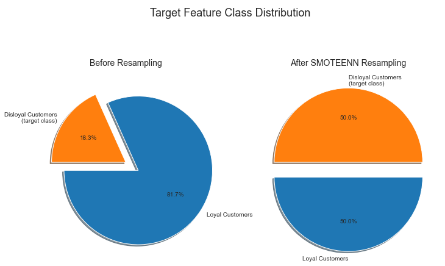
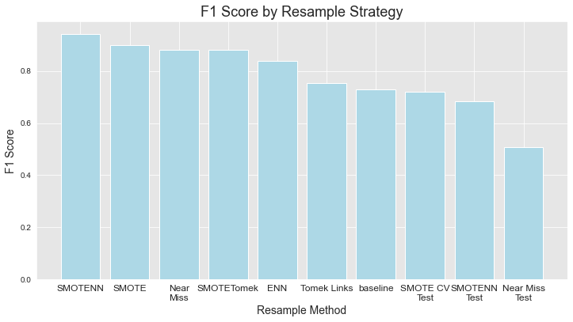
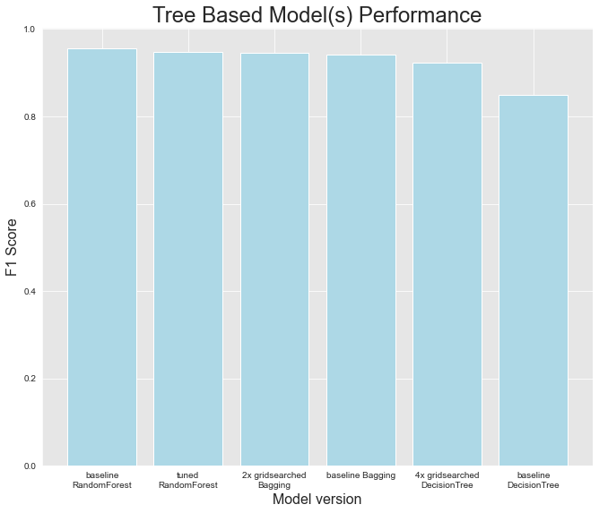

# Phase-3 Milestone Project: Sigma Airlines ML Analysis of Customer Satisfaction and Loyalty

**Author**: [Zeth Abney](mailto:zethusabney@gmail.com)

## Final Project Submission

Please fill out:
* Student name: Zeth Abney
* Student pace: Flex 
* Scheduled project review date/time: 07/08/2022 12:00pm
* Instructor name: Morgan Jones
* Blog post URL: [YouTube](https://www.youtube.com/playlist?list=PLEeKclZ1rcm_sYLz4rtNlv5PlWbln_0Zx)


## Overview 
Sigma Airlines is the premiere provider in public aviation transportion, constantly striving to provide the best value in customer experience and comfort. In order to contiune leading the industry in customer satisfaction, Sigma Airlines is taking steps to make more data-driven decions around how to continue improving the customer experience and improve satisfaction.  


## Business Case
A fundamental goal of the company is to deepen market penetration by converting non-habitual customers ('disoloyal') into habitually returning customers ('loyal'). In order to understand what might cause a disloyal customer to convert*into a loyal customer, its important to understand what differs between them in terms of the flights they are on and their impression of them. In other words if we can better understand our customers' *mood* about certain types of flights, we can better understand what improvements will make the greatest impression and therefore have the strongest impact on overall customer satisfaction. Using the [data](./data/) collected with machine learning technology, it is possible to discover patterns between these two target groups (i.e. loyal and disloyal) and perhaps identify the *risk factors* of customer "churn". The goal of this project will be to utilize machine learning in this fassion and make recomendations on what specific aspects of the customer experience to focus on improving. 


## Data Overview


The data used for the ML development involved in this analysis is sourced from this [Kaggle dataset]("https://www.kaggle.com/datasets/teejmahal20/airline-passenger-satisfaction?select=train.csv"). It is a dataset of over 100k records. Each record represents an individual customer, the details of their flight (e.g. distance, delay time), and survey responses regarding their satisfaction with the services rendered while boarding, in-flight and deboarding. 

A [data dictionary](./data/dictionary.md) was provided along with the dataset, which I have made available in a markdown file found in the data/ folder along with some summary statistics of each feature. The details of the preprocessing steps taken for this project are provided in the [EDA notebook](./development/EDA.ipynb) and [resampling notebook](./development/resampling.ipynb), which are both located in the development/ folder of this repository.

To summarize:  
    - The selected target feature is the column titled "Customer Type".  
    - The target feature is binary (Loyal/disloyal), and the target class is "disloyal". Disloyal is represented as 1, after one-hot-encoding.  
    - The target class is highly imbalanced with only about 18% of the raw training data being labeled as disloyal. The training data only is resampled using SMOTEENN, and ensemble of oversampling the target class with SMOTE and undersampling the non-target class with ENN.  
    - There are 4 features used that contain continuous data, providing details of the flight itself.  
    - There are another 18 features used that contain categorical data providing information on the customer themself and their trip (e.g. gender, purpose for travel) as well as the survey responses the customer provided.  


## Preprocessing Methods
The preprocessing used in this project spans two notebook files, located in the [development folder](./development/). The first, [EDA](./development/EDA.ipynb), covers the initial exploratory analysis, and prototyping various data cleaning and encoding methods. The second, [resampling](./development/resampling.ipynb), covers my process of experimenting with various resampling methods to address the issue of target class imbalance.

My general strategy to deal with the imbalance was to build a series of logistic regression models all with the same default hyperparameters, trained on the same data with the same preprocessiong, and the only difference being the algorithm used to resample the data. I eventually decided on the [SMOTEENN](https://imbalanced-learn.org/stable/references/generated/imblearn.combine.SMOTEENN.html) algorithm from the imblearn library, it is an ensemble method that combines minority oversampling with SMOTE and majority undersampling with Edited Nearest Neighbors. Both algorithms are distance based, so there is enough data between classes to train the model sufficiently however it maintains fidelity to the original relative rank of each class (i.e. the minority is still the minority). 


I focused primarily on F1 score when evaluating model iterations, I also took area under the ROC curve into consideration, however the dataset is fairly large so later on in the project his becomes less helpful. 

Fig. 1|Fig. 2
-|-
|

I was especially impressed that SMOTEENN was also able to maintain the class weights of categorical features and the distributions of continuous features. While the total volume of data increased, the shape and density of the data genereally did not, so the resampled dataset should be highly reflective of the original data. 


## Modeling Methods
After narrowing down the resample strategy to SMOTEENN, my next goal was to discover the best tree based classification algorithm to build the final model with. I used SciKit-Learn's GridsearchCV function to find the optimum hyperparameters for each tree-based model, and then compared the best of each type of model built, again focusing primarily on F1 score. I also considered the area under ROC curve, but at this point all the model's were *pretty good* and the dataset is quite large so it wasn' incredibly telling at this point. 

Fig. 3|Fig. 4
-|-
|

By F1 score it appears that the model was improving significantly with each iteration up until the last model I tried which was a random forest with non-default hyperparameters. The computational demand here was too great for my machine. I did however try several different sets of hyperparameters guided by the best parameters from the earlier decision tree classifier (the base model of the random forest), but nothing I tried could beat the default hyperparameters by F1 score or any other performance metric. I built the following plot to get a more granular visual of the performance trend across model iterations and it confirms to me what I was seeing through the classification reports. 


The final model's F1 score when measured on the test sample is 0.94, and its accuracy scored 0.98, which is quite acceptable for our purposes. 


## Model Evaluation
Afte developing a final model, the next step was to understand what it bases its predictions on and how it classifies customers as "loyal" or "disloyal". The model appeared to rely mostly on a customers age and the type of travel (business or personal), with strong consideration of the flight distance and the customers overall satisfaction (a boolean, 1-satisfied, 0-disatisfied). It should be noted that the overall satisfaction feature is probably a proxy to the set of survey response features, so the survey in aggregate should probably be regarded with as much weight as the overall satisfaction bool value. 

Among the survey Features, online boarding is the most important followed by seat comfort. Ease of online booking and inflight entertainment deserve mention as well. As do departure/arrival time convenience and gate location.


After inspecting the feature importances I decided to focus on disovering patterns according to age and/or flight distance. Especially in the clusters outlined in the plot below.


The following plot shows how customer satisfaction differs according to flight distance (above) and age (below), and contrasts this between loyal and disloyal customers. 


The most disatisfaction is found in the first and second quartiles of age and flight distance. Some of this may be due to relative scarcity of data for the more extreme ranges. Unsiprisingly, disloyal customers are the most disatisfied, especially at the lower ranges of age and flight distance. It is unlikely that improving satisfaction for flyers under 16 would have any real impact on loyalty conversion save for their satisfaction being a proxy to the parents satisfaction, which can not be made clear from this data. It is clear however that there is the bulk of disatisfaction to be addressed can be found on flights udner ~2500 miles and individuals under ~45.

I built the following plot in order to examine the relationship between overall customer satisfaction as a boolean value and aggregate customer satsifaction for each survey question as an ordinal categorical value (1-5).  


Again, unsuprisingly there is far more disatisfaction found within the disloyal sector of the market. Although there is more disatisfaction by volum from disloyal customers, the degree of disatisfaction for one survey question relative to the others is fairly consistent between loyal and disloyal customers.  

I also wanted to evaluate customer satisfaction per survey response constrained to the clusters outlined in the scatter plot above, as well as for business travel since it generally overlaps with those age/flight distance clusters. 

fig. 1|fig. 2
-|-
|

In the above visualization, fig. 1 on the left shows the market share of each group represented, and fig. 2 on the right shows that groups aggregate survey responses (i.e. each feature is summed, bar height represents sum total of responses). Red represents the bottom quartile of response for that groop, green represents the fourth quartile, and yellow represents the second and third quartiles. By market share, improving the satisfaction of the 70+ age group would probably not have a significant, if even noticeable, impact. Efforts should certainly be focused on 16-39 year olds, especially those flying under 3000 miles. Business travel for flyers under 80 and flight distances under 4000 miles should be prioritized as well. 


## Conclusions and Recomendations
I recommend focusing efforts to improve satisfaction of customer experience for individuals traveling for business purposes and/or between the ages of 16 and 40, for flights 3000 miles or less.  

Specific aspects of the customer experience on those flights that I predict will have the greatest return on efforts made are the customer's online experience (online booking, online boarding), internet dependent in-flight services such as wifi, and entertainment, and comfort related features of the flight itself such as seat comfort, food and drink, and overall cleanliness. 

Improving gate location as well as the convenience of the departure and arrival times would have a great impact according to my analysis of the data, however I do not believe it would be economical to implement changes here because it would require significant coordination and concession by and width other airlines as well as the FAA. 

It is best to focus on improving inflight services like wifi and entertainment, refreshments and seat comfort, and the UX of pre-boarding online services for business flights and youn adults flying less than 3000 miles.


## Next steps
Within this dataset gender is almost perfectly balanced making it an ideal candidate for classification. It is worth investigating how satisfaction of different aspects of the customer experience differs between genders. This data set contains information about the distance of the flight itself, and the customers satsifaction with the gate location, but it does not contain information on what airport is being flown out of or into, nor what the specific gate number(s) are. Having this information would make it possible to better understand how customer satisfaction differs throughout the various interest groups investigated, in the context of a specific airport or even gate. 


## For More Information
See the full analysis in the [final notebook](./student.ipynb) 
For additional info, contact Zeth Abney at [zethusabney@gmail.com](mailto:zethusabney@gmail.com)


## Repository Structure
```
├── development (.ipynb  files)
├── images (.png files mostly)
├── review (.pdfs of iPython notebooks)
├── dictionary.md (data dictionary)
├── README.md
└── student.ipynb (final analysis notebook) 
```