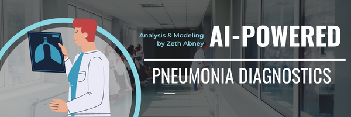

# Phase-4 Milestone Project: Computer Vision Modeling for Pneumonia Diagnosis

Author: [Zeth Abney](https://www.linkedin.com/in/zeth-abney/)  
Pace: Flex
Project Review data & time:   
Instructor Name: Morgan Jones  
Blog Post URL:   

#      

The goal of this project is to develop a convolutional neural network (CNN) designed to view images of chest x-ray scans and classify the images as showing symptoms of pneumonia (a label of '0') or not (a label of '1'). If succesful, the resulting model would be used to assist medical professionals by expediting the diagnostic process. This project aims to develop an AI that would power a software tool that could be added to the medical proffesionals tool bag and help make diagnosing Pneumonia easier and faster. This would benefit both the medical providers and patients by reducing man-hours per diagnosis thereby reducing overall costs. This AI model is being developed independently by myself with the goal of being absorbed by a larger relevent medical service busines. Once the model is ready for beta testing, the next step will be to pitch the product to stake holders of interested businesses who would have the resources develop an industry grade UI for the product and robust UX research.  

#   

Pneumonia is an infection of the lung that is quite prominent in the US today despite having some of the best medical care available. Pneumonia is the leading cause of death worldwide for children under 5 and is the most common cause for hospital admissions in the US, save for pregnancy[1](https://www.thoracic.org/patients/patient-resources/resources/top-pneumonia-facts.pdf).  

It is clear that there is much room for innovation in the way we handle the scourge Pneumonia, however the medical care *system* is notoriously complex and slow to adapt to the rapidly evolving technological landscape. Instead of reinventing the wheel, it is best to leverage extant industry technology and processees that capture Pneumonia among other diseases. Due to the ubiquitious use of x-ray technology around pneumonia and other diseases of the chest and torso, a wealth of image data is available that demonstrates quality examples of both healthy (or at least without pneumonia) respiratory tracts and those, in fact, with pneumonia.  

A computer vision based machine learning model (ML), once properly trained and optimized, could easily be folded into the afformentioned existing technology. By partnering with the software providers behind the existing technology used to capture, view and store x-ray data. Said ML could easily be incorporated into the software and its *prediction* be provided to the medical profesional at their discretion. So long as clear and concise documentation is provided to the medical profesionals regarding how best to utilize and interpret this new AI feature of their pre-existing software this could potentially expedite the diagnostic timeline and provide the care provider with greater confidence in their own diagnoses.

In other words, the business goal of this project is to be absorbed by an existing software provider that can integrate this AI model as the underlying engine for a new tool and/or feature in their existing, deployed software. The benefit to said software provider is to circumvent the AI development process and focus on areas they are already expert at such as UI/UX, backend, database, etc. This allows the software provider to further improve their product, without pioneering into totally new territory; likewise allows myself as a datascientist to make a meaningful and profitable impact without the cost of learning or hiring for a litany of adjacent skill sets.  

# 
This project utilizes a dataset of several thousand images of chest x-ray scans from a women's and children's hospital in Guangzhou, China. As shown in the [EDA notebook](eda.ipynb), class balance for each sample split is as follows: Training set is 74% true positives, test set is 63% true positives, and validation set is 50% true positives.

This dataset originally comes from [Mendeley Data](https://data.mendeley.com/datasets/rscbjbr9sj/2) and it was directly sourced for this project from [Kaggle.com](https://www.kaggle.com/datasets/paultimothymooney/chest-xray-pneumonia) using the kaggle API on the command line. The original kaggle post describes the dataset as follows:

> The dataset is organized into 3 folders (train, test, val) and contains subfolders for each image category (Pneumonia/Normal). There are 5,863 X-Ray images (JPEG) and 2 categories (Pneumonia/Normal). Chest X-ray images (anterior-posterior) were selected from retrospective cohorts of pediatric patients of one to five years old from Guangzhou Women and Children’s Medical Center, Guangzhou. All chest X-ray imaging was performed as part of patients’ routine clinical care. For the analysis of chest x-ray images, all chest radiographs were initially screened for quality control by removing all low quality or unreadable scans. The diagnoses for the images were then graded by two expert physicians before being cleared for training the AI system. In order to account for any grading errors, the evaluation set was also checked by a third expert. 

# 

As mentioned above the data comes already split into three distinct samples (Train, test, and validate). Additionaly the originators of the data have already performed quality control and binary class labeling by qualified professionals. There was no use of resampling methods throughout this project due to the sufficient volume of data (i.e. even the minority class is composed of several thousand data points). Therefore the only data preparations steps left were to prepare the image files to be "readable" to a Keras CNN, this was achieved using the Keras [ImageDataGenerator](https://www.tensorflow.org/api_docs/python/tf/keras/preprocessing/image/ImageDataGenerator) class along with its related flow_from_directory() method to read the jpg files into the generator. Upon instantiation of the generator objects the data is normalized so that all first order tensors are scaled 0-1 instead of 0-255 (standard pixel values), and is set to grayscale so that each image is represented by a two dimensional tensor with a single color channel instead of three.

One key advantage to utilizing the ImageDataGenerator class is that it allows the X and y data to be readable by other Keras function and methods with a single variable. The generator objects all share the same parameters; the color mode is set to grayscale, reducing unnecessary volume and complexity of the input data, the class mode is set to binary, reflecting the binary classification requirements of this project, images are resized to 150 by 150 pixels, and the batch size was originally 16 but then reduced to 8 as it appeared to improve the models ability to learn. 
 
For more details on the data and the preprocessing steps take please review the [EDA notebook](eda.ipynb) 

# 
The modeling process, demonstrated in detail in the [Modeling notebook](modeling.ipynb), consisted of first building a baseline model with a lean and arbitrary architecture and training protocol, and then measuring more complex and sophisticated iterations against the initial basline model. The measures used primarily were recall and F1-score.

## Model Architecture
The first major iteration was experimenting with the architecture of the model itself. This was iterated on later throught the model development process and it was eventually decided on that a relatively simple model architecture was the best direction to take. 

| Baseline Model Summary       | Final Model Summary      |
| ------------- | ------------- |
|||

## Model Training Protocol
The next major iteration was experimenting with more robust training parameters (specifically within .fit() function). Various arrangements of steps per epochs, total number of epochs and validation steps per epoch were all experimented with. Eventually it was discoverd that the model tends to learn faster, so the final model was trained on a relatively small amount of epochs (while also using an early stoppage technique) and a moderate amount of steps per epoch. 

| Baseline Model Training       | Final Model Training      |
| ------------- | ------------- |
|||
|||
|||

## Network Regularization
The third major phase of model development was experimenting with various regularization techniques. The least effective of which was dropout regularization (dropping out random nodes from certain layers), this technique made the key performance indicators (KPIs) extremely eradic and not obviously converging on any values or approaching any limits (i.e. lots of zig zigs, not a lot of curves). Hoever L2 regularization showed clear benefits and after some experimentation a weight of 0.005 showed to be the most optimal.  

| L2 Regularization       | Dropout Regularization      |
| ------------- | ------------- |
|||
|||

## Optimization Algorithm
The fourth major iteration was experimenting with various optimization algorithms. Up until this point in the project there had been none specified and keras was using whatever default algorithm it assigns (I have so far been unable to find documentation specifying exactly what algorithm that is). After testing three different algorithms, [stochastic gradient descent](https://keras.io/api/optimizers/sgd/), [adaptive momentum estimation](https://keras.io/api/optimizers/adam/), and [adaptive delta](https://keras.io/api/optimizers/adadelta/), it was discoverd that Adam (adaptive moment estimation) was the best algorithm for this model and this project.  

| Algorithm       | Classification Report      | Confusion Matrix   |
| ------------- | ------------- | ------------- |
|Adam|||
|SGD|||
|Adadelta|||  

## Learning Rate
The fifth and final iteratation of model development was experimenting with various learning rates of the Adam optimization algorithm. After some experimentation it was determined that the optimal learning rate using adam is .01. Examples of each learning rate tested are not available in the modeling notebook, I essentially re-ran the exact same at various learning rates and took note of the KPIs, this was in the interest of the readibility of the notebook. The learning rate parameter can be easiliy located in the "Learning Rate and Early Stopage" section of the modeling notebook and can be easily changed and re-ran if you are so-inclined. 

|        |       |
| ------------- | ------------- | 
|Classification Report||  
|Loss||
|Recall||
|Confussion Matrix||  

#  
The key performance indicators utilized for this project are primarily recall, and loss. F1-score is consdiered to provide context to the dynamic between recall and precision while accuracy is considered to provide context to the dynamic between recall and loss. In the medical industry it is prefered to have high risk of false positives and low risk of false negatives, rather than a high accuracy with a relatively higher false negative rate. All this considered recall is the main KPI that I sought to improve while the others provide context for how to do that.  

The model had a tendency to overfit, made evident by results such as 1.0 recall and 7.84 loss, and an accuracy of  0.6. A result like this I interpreted as an indication that the model is correctly classifying all the cases of pneumonia but also miss classifying *a lot* of truly negative cases as positive. 

In essence a false positive rate greater than zero is okay for the end user so long as there are not so many false positives that it becomes untenable to cross-examine and verify with other diagnostic tools. This could potentially lead to the tool being more of a burden than an aid to the end user.

So my efforts throught the iterative process were focused on analyzing these KPIs and taking further steps to reduce the loss function as much as possible while mainting the recall as close to 1.0 as possible. In the end, the final model yielded a recall at almost exactly 1.0, and accuracy of 75%, and a loss of 0.68. This still has a lot of room for improvement, but compared to the previous evolutions of the model certainly moves in the direction of this projects goals and, more or less, achieves what it was meant to.

# 

The model definitely captures almost all the true cases of pneumonia, however at the cost of some false positive *"diagnoses"*. This dynamic is expected, and even par for the course within the medical industry. So despite the need for futher improvement upon the model I consider this project a success and a legitimate proof-of-concept. 

I recommend deploying this model to beta testing, so we can evaluate its real impact on end user workload, the diagnostic ability to actually aid the end user, and troubleshoot how to integrate the model into existing softwares. 

I recommend expanding the dataset to incorporate a more diversity of nationality and ethnic background among the subjects of the x-ray scans. 

So, the very next steps steps I recommend are . . .   
>A: find stakeholders of medical software providers willing to partner with or buy-out  
B: work with said stakeholders to beta test tool with a strategic selection of medical service providers relevant to this projects needs and goals  
C: collect data on the tools usability and real-world diagnostic performance, and also expand the underlying dataset for future model optimization.

# Repository Stucture
├── data (x-ray images organized by class intp subdirectories)  
├── images (jpg and png files used for presentation and aesthetics)  
├── presentation (contains pptx files used for non-technical presentation, and pdf files for project submission)     
├── eda.ipynb (exploratory analysis, previews data and tests modeling conventions)    
├── modeling.ipynb (contains all interations of the model and the respective analysese)    
└── README.md  