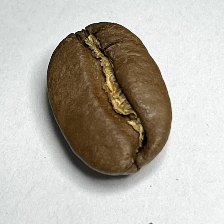
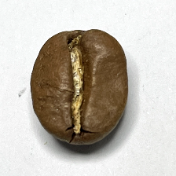
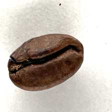
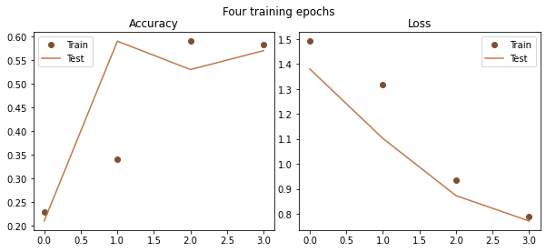
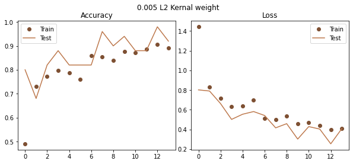
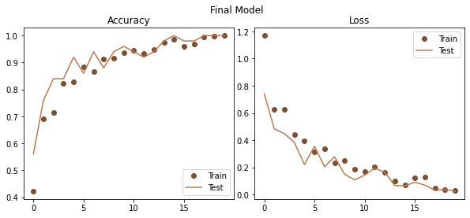
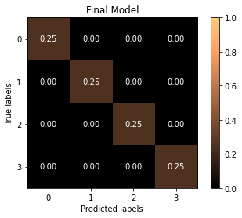
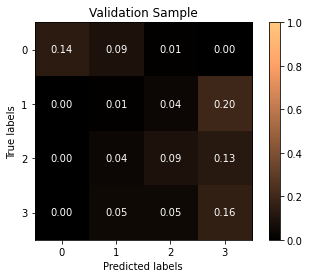
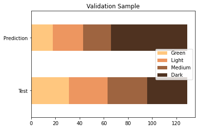
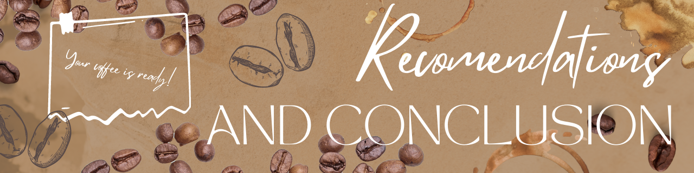

# 
This project aims to build a convolutional neural network that can classify images of coffee beans into one of four categories representing various stages of the roasting process: raw, light, medium, and dark. The model will take jpeg images of coffee beans as an input, analyze the image using convolutional layers, and make a prediction about the roast stage.

This project is important to pursue because it demonstrates how artificial intelligence (AI) can be used to improve processes and outcomes in the coffee industry. By leveraging the power of machine learning, coffee roasters can achieve greater consistency in their roasts, which can lead to higher quality coffee and increased customer satisfaction. Additionally, this project is just the tip of the iceberg when it comes to the potential for innovation in the coffee industry utilizing AI technology. There are many other applications of machine learning in the coffee industry, such as predicting consumer preferences, optimizing supply chain logistics, and improving the efficiency of coffee farming. As such, this project represents an exciting opportunity to explore the possibilities of AI in the coffee industry and beyond.  

The project can be broken down into the following steps:  
- Collect a dataset of labeled images of coffee beans in the four roast level categories.    
- Preprocess the images (resize, crop, normalize, etc.) to make them suitable for training the model.  
- Iterate over various versions of network architecture, hyperparameters and training protocols.   
- Evaluate the performance of each model version on a test dataset to determine accuracy and other key performance indicators (KPI)  
- Deploy the model to a system that can accept jpeg images as input, classify them, and alert workers when the desired roast is achieved. 

# 
This project has the potential to significantly improve the coffee roasting process in terms of quality control, labor efficiency, and profitability. By using a camera positioned above the roasting bin to periodically capture images and analyze the roast level of the beans, the system can help coffee roasters achieve greater consistency in their roasts. This can lead to higher quality coffee and increased customer satisfaction.  

In addition, this system can help reduce waste by alerting workers when the beans are overcooked or undercooked, thereby minimizing the amount of coffee that must be discarded. This reduction in waste can have a significant impact on a roaster's bottom line, as it reduces the cost of materials and increases profitability.  

Furthermore, this system can help workers be more productive by allowing them to focus on other tasks while the roasting process is underway. Since the system can monitor the roasting process and alert workers when the desired roast level is achieved, workers do not need to pay as close attention to each roasting bin. This can free up time and resources that can be directed towards other areas of the business, further increasing efficiency and profitability.
Overall, this project represents a powerful tool for coffee roasters looking to improve their operations and achieve greater success in the highly competitive coffee industry. By utilizing AI technology to improve quality control, reduce waste, and increase labor efficiency, coffee roasters can deliver a better product to their customers and increase their bottom line.

#  
The dataset used in this project comes from kaggle.com and consists of 1200 training images and 400 test images. Each sample is equally distributed between the four classes, with 300 images per class in the training set and 100 images per class in the test set. All the images are of a single coffee bean and are of size 224x224 pixels. The dataset's class labels are (Green, 0), (Light, 1), (Medium, 2) and (Dark, 3). The images were captured using an iPhone 12 mini, which means that the images are of high quality and consistent.

To further test the model and the dataset's limitations, I am creating a small validation dataset using my own iPhone 13 pro camera. This dataset will include images of both single coffee beans, like the training and test data, as well as images of multiple beans. By doing so, I hope to evaluate the model's performance in detecting the stage of the roasting process as well as get a feel for the models limitations.

|Train|Test|Validation|
|-----|-------|-----------|
||||

Overall, I believe that this dataset provides a good representation of the different stages of coffee bean roasting, and I am confident that our model can successfully classify coffee bean images.  

# 
To prepare the image data for modeling, I utilized the ImageDataGenerator class from Keras to read in the PNG files and directly access the image data as matrices. This method makes it easy to load in and preprocess large datasets. The ImageDataGenerator objects were set to normalize the pixel values to a scale of 0-1 using the rescale argument. I also set the color_mode argument to grayscale since I only need to work with a single channel for these images.

Normalizing the pixel values and setting to grayscale are standard practices for image classification tasks. Normalizing the pixel values scales down the pixel values to a range that is better suited for machine learning algorithms, while setting the images to grayscale removes color as a variable in the analysis, simplifying the model's learning process.

When preparing new data to add to the validation sample that was not part of the original train/test dataset, I developed a function in the [project toolkit](project_toolkit.py) module to aid in the preprocessing of these images.

The function, preprocess_new_image(source_dir:str, target_dir:str,debug_mode=False), preprocesses all the image files in a directory by resizing them to a fixed width and height of 224 pixels and then saving them as PNG files in a the target directory with file names that represent their label and index. It takes in the source and target directory paths as arguments, and has a debug_mode parameter that will print the target path of each file being iterated over instead of actually saving the file at that location.

#  
For this project, I developed a convolutional neural network (CNN) using Keras to classify different levels of roast for coffee beans. A CNN is an ideal model choice for image classification tasks like this one because it can effectively extract important features from the input images through convolutional layers, and can then use pooling layers to reduce dimensionality and improve computational efficiency. Additionally, CNNs are able to learn hierarchical representations of the input images, which is especially useful for image recognition tasks where features like edges, shapes, and textures can be learned at lower layers and combined to identify more complex features like object shapes and patterns at higher layers.

Keras is a great tool for building CNNs because it provides a user-friendly and high-level interface for constructing and training deep learning models. Its simple and intuitive syntax allows for rapid prototyping and iteration, making it ideal for experimentation and development. Keras also offers a variety of pre-built neural network layers and optimization algorithms, which can save time and reduce the complexity of building deep learning models from scratch. Overall, using Keras made it easier for me to focus on the specific details of my project rather than worrying about low-level implementation details.

During the development of the model, several iterations were tested to improve its performance. The best model was achieved by training the model for 16 epochs using 48 steps per epoch and a batch size of 25, with early stopping callback to prevent overfitting. L2 regularization was also added to the two Dense layers of the model to further improve its performance.  

The final model architecture consists of 3 convolutional layers with max pooling, followed by 2 fully connected (Dense) layers and an output layer with a softmax activation function. The model has a total of 4,319,788 trainable parameters.

#  
In this project, I have chosen accuracy as the primary KPI for evaluating the performance of the model. Since this is a multi-class classification problem where each class is equally important to be predicted correctly, accuracy provides a straightforward way to measure the percentage of correct predictions made by the model across all classes. Additionally, I also monitored loss during training to provide context when accuracy is not doing well.

To delve deeper into the model's performance, I wrote several functions that are available in the project_toolkit.py module. These functions are designed to make it quick and easy to calculate various KPIs, make predictions, and evaluate the quality of the predictions.

For instance, the evaluate_model() function can be used to obtain detailed information like a classifaction report, confusion matrix, and label predictions. Furthermore, functions like viz_confusion_matrix, among others, use the return values of the former function to create useful visualizations of the model's performance.

Overall, the project_toolkit module offers a variety of useful functions for evaluating the performance of the model. It not only provides a simple way to calculate KPIs and create visualizations of the model's predictions but also offers various methods for evaluating the model's quality. This approach to evaluation is particularly relevant in this use case where we want to accurately classify the roast level of coffee beans.

## Validation Testing

The validation sample used for testing the model was sourced from two different local coffee shops and one local roastery. The images were captured on a personal iPhone 13 using ambient fluorescent light and direct LED light set at 4500K with a white background, in order to replicate the lighting conditions of the kaggle dataset as much as possible.  

The model's performance on the validation sample was rather poor, with an overall accuracy of 38%. However, the patterns in the model's mistakes were consistent with my expectations. The model tended to classify the validation sample incorrectly towards the darker side, where raw coffee was sometimes classified as light, a light roast was classified as medium, and a medium roast was classified as dark, etc.

After consulting with the local roaster from whom I sourced the raw and light roast coffee beans for the validation set, I learned that the "light roast" in from the training and test samples would probably be considered "white coffee" by most roasters, which falls between raw and what he considers a "light roast." This information helped me understand why the model may have struggled with correctly classifying light roasts. It is probably more of a human labeling issue than a limitation of the models ability to distinguish between classes.  

Despite the poor performance on the validation sample, I am actually excited by the outcome. The model performed exceptionally well on the test data, which raises some suspicion as to whether the model was overfitting to the test dataset. Testing the model with truly unseen data was important, and the fact that the model underperformed in a way that was expected based on my conversation with the local roaster actually increased my confidence in the project's potential for a profitable production application.

# 

The scope of this project was to develop a convolutional neural network (CNN) model to classify images of coffee beans into four roast categories: green, light, medium, and dark. While this model can accurately classify individual bean images, it is important to note its limitations in a production setting.

One major limitation is that the model was trained on images of single beans, whereas in a production setting, the input data is likely to be a video feed of an entire roasting bin with thousands of coffee beans. It is unclear how the model will handle images of multiple beans that overlap with one another. Additionally, the model would need to be modified to take in video data or develop a data pipeline that preprocesses the video feed data into image data that can be input into the model (the latter is preferable).

Another limitation is that the entire training and test dataset came from the same roastery. Roasteries may differ in terms of what they consider light, medium, or dark roast. Some roasteries also sell blends, which mix multiple roasts together. Therefore, the model should be modified to output predictions on a gradient rather than four distinct classes to account for differences between what different roasteries consider light, medium, and dark and also account for blends that are somewhere in between these distinct classes.

Lastly, all of the training and test images were taken on the same iPhone 12 camera, and the validation dataset was captured on my personal iPhone 13 camera. Therefore, there may be inconsistencies in image quality and lighting conditions despite best efforts to recreate the resolution and lighting of the train/test dataset.

This project serves as a proof-of-concept that a CNN can be efficiently developed to address this classification problem. The project demonstrates that it is possible to take images from a variety of sources and preprocess them in a way that the model can take any of them as inputs. However, it is important to note that the model is far from being ready for use in production due to the aforementioned limitations.

# 
After developing and testing the model, I would like to share some recommendations and conclusions based on the project.

Firstly, I recommend expanding the dataset to include images of coffee beans from different roasteries, including images with multiple beans that overlap with one another. This will help improve the model's accuracy and ability to handle images from a variety of sources.

Secondly, I suggest beginning development of a video-to-photo data pipeline to preprocess video feed data into image data. This will require exploring the use of a pretrained model (probably in OpenCV) to perform object detection and generate bounding boxes, followed by taking snapshots of everything within each bounding box. With reliable bounding box generation, this approach should work with minimal issues throughout development.

Lastly, I recommend involving a software developer and UX designer in the project to focus on building an end-user application that can be easily installed and run on any machine. The application should be designed for non-technical users to easily utilize it with little to no specialized training.

In conclusion, this project is a successful proof-of-concept and worth investing resources into in order to bring it to production. Although there are limitations, this project has shown that it is possible to efficiently develop a CNN to address this classification problem and take images from a variety of sources, including within an application that non-technical users can interface with. If brought to production, this project has the potential to increase productivity and profitability by allowing for greater consistency in quality control and leveraging human capital by automating traditionally manual tasks. I am excited about this outcome and eagerly await any feedback.

## Contact Me:
I sincerely appreciate you taking the time to review this repository and hope you have gained some value from this data science project.  

If you have any questions, suggestions or otherwise in need of contacting me you can find me through:
- [LinkedIn](https://www.linkedin.com/in/zeth-abney/)
- [Instagram](https://www.instagram.com/texan_space_cowboy/)
- zethusabney@gmail.com

If you are curious about Flatiron School or data science bootcamps in general you can see my entire bootcamp journey on my youtube channel [Data Cowboy](https://www.youtube.com/channel/UCkYdKUId0iITN_czJ0X-sbA)

# Repository Stucture
├── [data](data) (png images of single coffe beans organized by class into subdirectories, gitignored)  
├── [images](images) (png and jpeg files used for embelishment and presentation)   
├── [presentation](presentation) (contains pptx presentation files, pdf submission files, gitignored)  
├── [Coffee Classifier](notebook.ipynb) (source code for proof-of-concept GUI application)  
├── [notebook.ipynb](notebook.ipynb) (contains all the code and documentation of the technical methods used)   
├── [project_toolkit.py](project_toolkit.py) (source code for functions used for data visualization, model evaluation, and data preprocessing)  
└── README.md  (you are here)